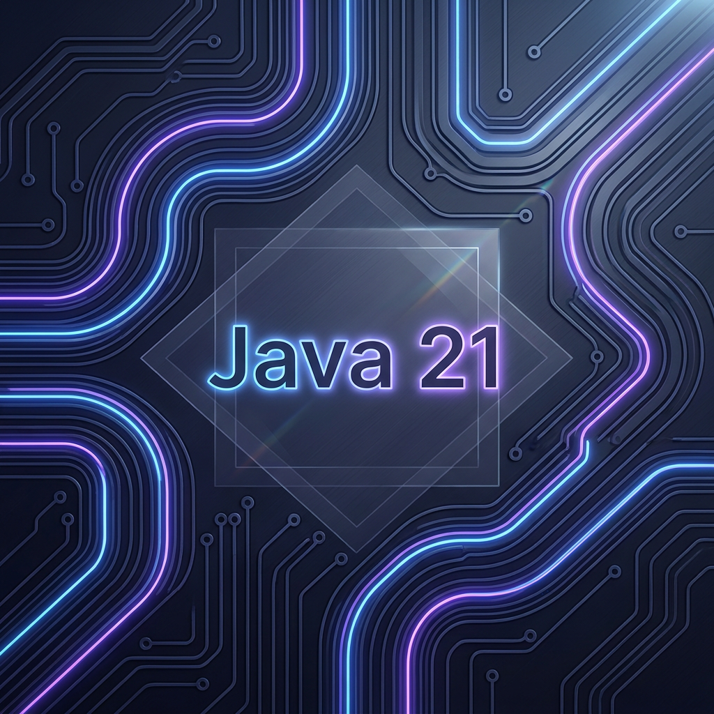
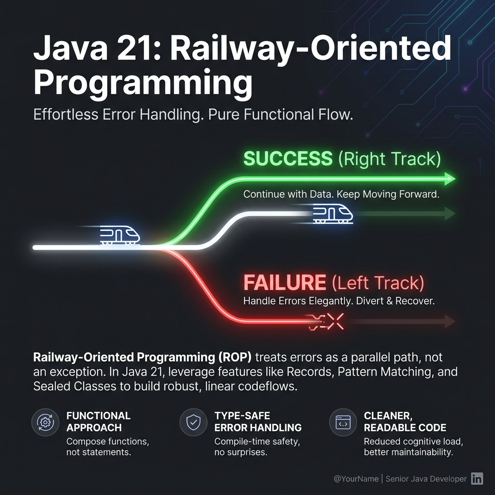

# Beyond Object-Oriented: My Java 21 Functional Journey

Welcome! If you still think of Java as a verbose, purely boilerplate-heavy Object-Oriented language, this post is for you. Having spent time working inside this modern Java 21 playground, I’ve discovered how **type-safety**, **immutability**, and **Railway-Oriented Programming (ROP)** can completely revolutionize how we write robust backend services.

Here are the key architectural paradigm shifts and technical lessons I’ve learned from this codebase.

---

## ⚡ 1. "Parse, Don't Validate" — Safe Boundaries

One of the most powerful functional patterns is the concept of **Type-Driven Domain Modeling**. Instead of representing everything with primitive types (`String isbn`, `Long memberId`) and constantly checking them for `null` or invalid formats throughout our code, we enforce validity **at construction**.

```
                           THE PARSING BOUNDARY
                           
  Raw Input (JSON) ──► [ DTO Record ] ──► [ Custom Constructor ] ──► Domain Type
                                                  │
                                                  ▼
                                       (Guaranteed Valid!)
```

### The Two-Step Parsing Gap (The Jackson Tax)
In languages like F#, deserializers let you parse JSON directly into fully-validated custom types. In Java, Jackson (the default Quarkus/Jakarta JSON deserializer) demands standard constructors or no-arg layouts. 

To overcome this, we implement an elegant **two-step parsing flow**:

1. **Step 1: REST Boundary (DTO)** — Capture input with basic Java records and annotate them using standard Bean Validation (`@NotNull`, `@Size`).
2. **Step 2: Domain Boundary (Command)** — Map the raw fields of the DTO into strongly-typed domain value records.

```java
// STEP 1: The Raw DTO
public record LendRequest(
    @NotBlank String isbn,
    @NotNull Long memberId,
    @NotNull LocalDate dueDate
) {}

// STEP 2: The Parsing Moment in the Controller
@POST
public Response lend(@Valid LendRequest request) {
    // This is the F#-style "Parse" moment — strings become guaranteed types!
    var command = new LendCommand(
        new Isbn(request.isbn()),           // Constructor validates ISBN format
        new MemberId(request.memberId()),   // Constructor validates ID format
        request.dueDate()
    );
    ...
}
```

Once a `LendCommand` enters our service, it is **impossible** for its data to be invalid. We can safely bypass all null checks and validation boilerplate in our core business logic!

---

## 🛤️ 2. Railway-Oriented Programming with `Either<L, R>`

Handling exceptions in business logic is an anti-pattern in functional programming. Exceptions break the natural return flow of methods and pollute our services with nested `try-catch` blocks. 

Instead, we represent the flow as a **railway track**:
* **Right Track (Success)**: Contains the successful entity/result.
* **Left Track (Failure)**: Short-circuits the pipeline and carries typed failure details.



By using the project's monadic `Either<L, R>` container, we chain our operations using `flatMap`:

```java
public LendingResult lend(LendCommand command) {
    return findMember(command.memberId())             // Either<LendingResult, Member>
        .flatMap(this::checkNoOverdue)                // Either<LendingResult, Member>
        .flatMap(_ -> findBookItem(command.bookId())) // Either<LendingResult, BookItem>
        .flatMap(item -> persistLending(item, command))// Either<LendingResult, BookLending>
        .fold(
            error -> error,                           // Left: Return the error variant
            LendingResult.Success::new                // Right: Wrap the success result
        );
}
```

If any step fails (e.g., `findMember` returns a `Left` containing `MemberNotFound`), the remaining steps are skipped, and the error flows directly to the final `.fold()` exit ramp.

---

## 💾 3. Sequence Pre-fetching vs. `BIGSERIAL` (The Panache Trap)

In database design, it's tempting to use PostgreSQL's `BIGSERIAL` for auto-incrementing primary keys. However, I learned that Hibernate/Panache expects **Sequence Generators** (`BIGINT` with an incrementing sequence).

Here's why this matters for performance:

```
BIGSERIAL Workflow:
INSERT ──► [Database] (DB generates ID=1) ──► ID returned (Roundtrip on EVERY insert)

Panache Sequence Workflow (Increment by 50):
[Hibernate] ──► SELECT nextval('SEQ') ──► Generates block (1-50)
[Hibernate] ──── (Assigns ID=1 locally, no DB call!)
[Hibernate] ──── (Assigns ID=2 locally, no DB call!)
...
[Hibernate] ──── (Assigns ID=50 locally, no DB call!)
```

By pre-fetching a batch of 50 IDs, Hibernate drastically cuts down on database roundtrips, facilitating blazing-fast batch inserts.

> [!TIP]
> Always define your Flyway migration schema using matching sequences:
> `CREATE SEQUENCE book_SEQ START WITH 1 INCREMENT BY 50;`

---

## 🔒 4. Transaction Boundaries: Keep Entities Isolated

Another key rule of clean architecture is isolating transactions. `@Transactional` belongs strictly on the **Service Layer**, not on the Resource/Controller layer.

* **The Transaction Boundary**: Entities are loaded and mutated *only* inside the transaction.
* **The Record Conversion**: Before returning the result of a service, we map our mutable JPA Entities into immutable records.
* **Safe Return**: The Resource Layer only receives immutable records, completely avoiding `LazyInitializationException` and preventing database transactions from remaining open during HTTP response generation.

```
  HTTP Request ──► [Resource: Parse Command]
                           │
                           ▼ (No Transaction)
                   [Service Layer]  ◄─── Transaction Begins
                   │  • Load Entities
                   │  • Apply Rules
                   │  • Convert Entities ──► Immutable Records
                   ▼
                   [Resource: Pattern Match] ◄─── Transaction Ended & Flushed
```

---

## 🏁 Summary of Learnings

By modeling our systems using Java 21's functional paradigm, we achieve:
* **Compile-time safety**: The compiler guarantees we exhaustively handle every single business outcome.
* **Expressive Flow**: No nested `if-else` blocks or exception checking—just a clean, declarative linear pipeline.
* **Blazing Performance**: Optimized database ID batch pre-fetching and lightweight, stack-trace-free error routing.
